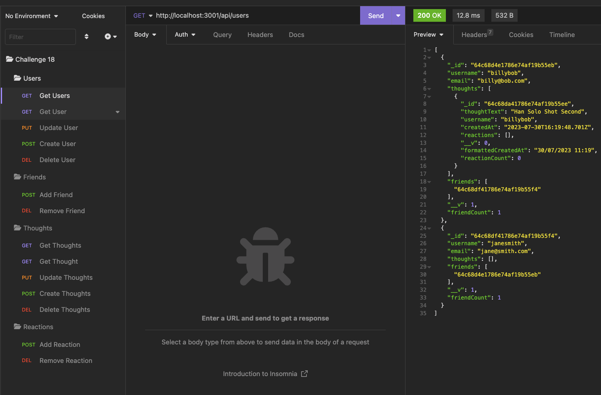
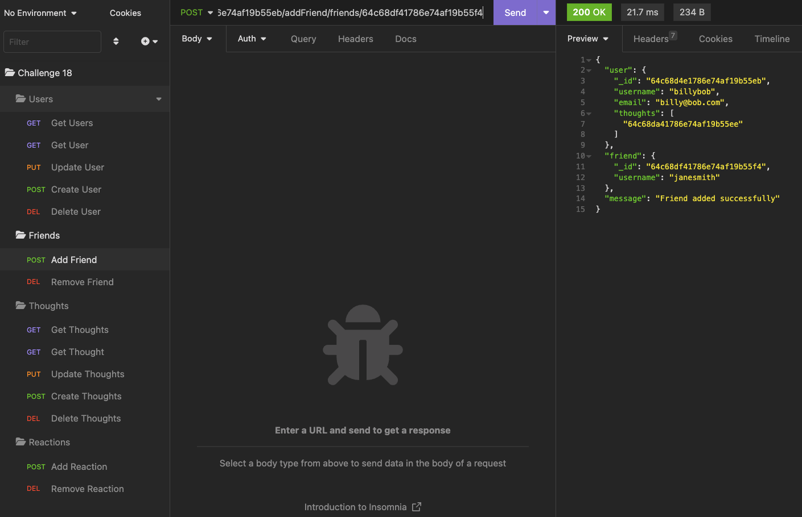
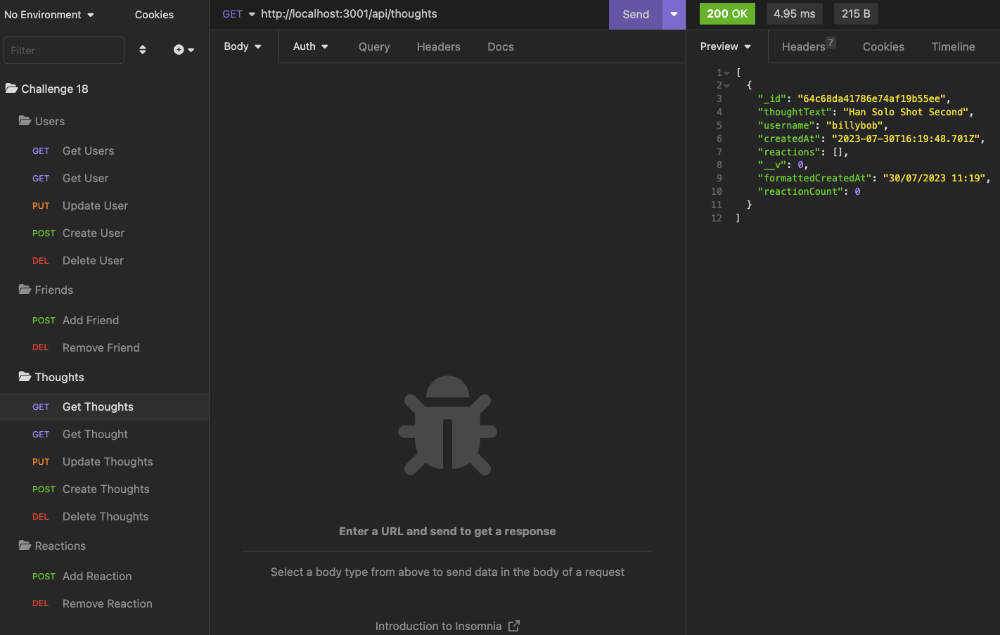
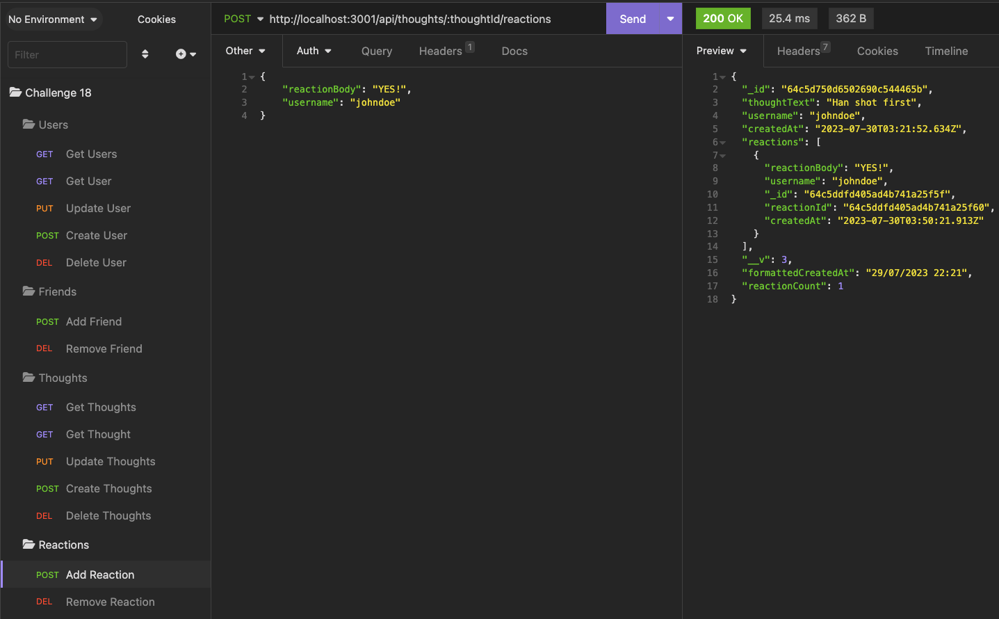

# NoSQL-Social-Network-API

 

## Description

This project is a social network api using mongoose, mongodb, and express that allows for a user to send API request to add, create, update, and delete users, thoughts, and reactions to the mongodb database. The most challenging aspect of this challenge for me was getting use to the new database and how it works, but once I figured it out the flow seemed to be smooth.

## Table of Contents

- [Link](#link)
- [ScreenShot](#screenshot)
- [Installation](#installation)
- [Usage](#usage)
- [Credits](#credits)
- [License](#license)
- [Badges](#badges)
- [API](#api)

## Link

Below are links to the walk-thru video of the app and the repo: 
[Walk_Thru_Video](https://drive.google.com/file/d/1i9zvDTln4f_nsd15pYJJvn5Nm-nrLplY/view) 
[Projects_Repo](https://github.com/garciajv86/NoSQL_Social_Network_API) 
[Heroku_Deployed_App](https://social-network--api-3ecd2fb1697d.herokuapp.com/)

## ScreenShot
Insomnia Screenshots:
 

## Installation

This app requires Node.js to be installed on your computer to work as well as MongoDB. 
[MongoDB Download](https://www.mongodb.com/docs/search/?q=MongoDB+download+communtiy+edition) 
[Node.js Download](https://nodejs.org/en)

## Usage

To use this app, cd to the apps directory at the server.js level and then run the command npm i to install all the dependencies. Once all dependencies are installed you can run the command npm start to start up the server, then in your browser or an app like insomnia you can make you API request with the appropriate parameters.

## Credits

- Joshua V. Garcia

- [My GitHub Profile](https://github.com/garciajv86)

## License

 
This project is protected under the [MIT](https://choosealicense.com/licenses/mit/) License.

## Badges

 

 

 

## API

MongoDB and Mongoose was the NPM packages used for this project

- [MongoDB Docs](https://www.npmjs.com/package/mongodb)
- [Mongoose Docs](https://www.npmjs.com/package/mongoose)
